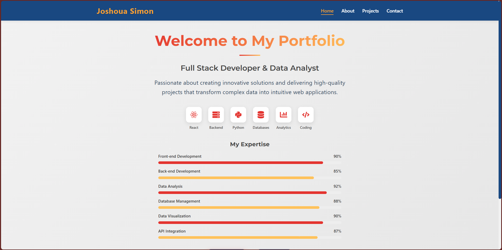

# 🚀 Personal Portfolio Project: A Learning Journey

## 🎯 Project Purpose
This portfolio is more than just a showcase – it's a learning resource for developers looking to build their own professional portfolio using React.

## 🌐 Live Preview
- **Website**: [Your Portfolio URL]
- **GitHub Repo**: {https://github.com/Joshoua1/Portfolio}

## 🔍 Learning Objectives

### For Aspiring Developers
- Understand React project structure
- Learn component-based architecture
- Explore responsive web design
- Implement email communication
- Create a professional portfolio template

## 📂 Project Structure Breakdown

### Why This Structure Matters
```
joshoua_port/
│
├── src/                   # Source code directory
│   ├── Assets/            # Static resources
│   │   ├── Images/        # Project and profile images
│   │   └── pdf/           # PDF documents (resume)
│   │
│   ├── components/        # Reusable React components
│   │   ├── Footer.js      # Page footer component
│   │   └── Header.js      # Navigation header
│   │
│   └── pages/             # Main page components
│       ├── About.js       # About me page
│       ├── Contact.js     # Contact form
│       ├── Home.js        # Landing page
│       └── Projects.js    # Projects showcase
│
└── server.js              # Backend server configuration
```

## 🚀 Getting Started: From Zero to Portfolio

### 1. Fork and Clone

#### Why Fork?
Forking allows you to:
- Create your own copy of the project
- Customize without affecting the original
- Learn by modifying existing code

```bash
# Step-by-Step GitHub Workflow
# 1. Go to https://github.com/Joshoua1/Portfolio
# 2. Click "Fork" button at top right
# 3. Clone YOUR forked repository

git clone https://github.com/Joshoua1/Portfolio
cd joshoua_port
```

### 2. Personalization Checklist

#### 🔄 Files to Customize
- `src/pages/About.js`: Replace personal description
- `src/pages/Projects.js`: Add your projects
- `src/Assets/Images/`: Replace profile and project images
- `server.js`: Configure your email settings

#### 💡 Personalization Tips
- Use consistent, professional imagery
- Write a compelling personal narrative
- Showcase your best projects
- Keep design clean and responsive

### 3. Development Setup

#### Prerequisites
- Node.js (v14 or newer)
- npm (v6 or newer)
- Basic understanding of React

```bash
# Install Dependencies
npm install

# Environment Configuration
# Create .env file in project root
REACT_APP_EMAIL_SERVICE=your_email_service
REACT_APP_EMAIL_USER=your_email
REACT_APP_EMAIL_PASS=your_app_password
```

### 4. Running the Project

```bash
# Start Development Server
npm start

# Run Tests
npm test

# Build for Production
npm run build
```

## 🛠 Advanced Customization

### Styling
- Modify `App.css` for custom themes
- Use CSS modules for component-specific styles
- Consider CSS frameworks like Tailwind

### Performance
- Optimize images
- Use React.lazy for code splitting
- Implement proper error boundaries

## 🌐 Backend Email Service (server.js)

### 📧 Email Sending Functionality

#### Purpose
The `server.js` file is a crucial component that handles email communication for the portfolio contact form using Node.js, Express, and Nodemailer.

#### Key Features
- Express server setup
- CORS middleware
- Secure email transmission
- Error handling
- Environment variable configuration

### 🔒 Security Configurations

#### Environment Variables
Create a `.env` file in the project root with:
```
EMAIL_USER=your_gmail_address@gmail.com
EMAIL_PASSWORD=your_gmail_app_password
```

#### 🚨 Important Security Notes
- Use Gmail App Password, not your regular password
- Enable 2-Step Verification in Google Account
- Generate App Password specifically for this application

### 🛠 How to Generate Gmail App Password
1. Go to Google Account
2. Security > 2-Step Verification
3. App Passwords
4. Select "Mail" and "Other (Custom name)"
5. Generate and copy the App Password

### 📦 Required Dependencies
```bash
npm install express nodemailer cors dotenv
```

### 🔍 Code Breakdown

#### Middleware
```javascript
app.use(cors()); // Allow cross-origin requests
app.use(express.json()); // Parse JSON request bodies
```

#### Email Sending Endpoint
- Route: `/api/send-email`
- Method: POST
- Accepts: `name`, `email`, `message`, `recipient`

#### Transporter Configuration
```javascript
const transporter = nodemailer.createTransport({
  service: 'gmail',
  auth: {
    user: process.env.EMAIL_USER,
    pass: process.env.EMAIL_PASSWORD,
  },
});
```

### 💡 Best Practices
- Use environment variables for sensitive information
- Implement rate limiting
- Add input validation
- Log email sending attempts
- Handle errors gracefully

### 🚀 Deployment Considerations
- Use secure, production-ready email services
- Consider email service providers like SendGrid, Mailgun
- Implement additional security measures

### 🛡️ Error Handling
- Catches and logs email sending errors
- Returns appropriate HTTP status codes
- Provides feedback on email transmission status

### 📝 Logging
- Logs successful email sends
- Logs error details for debugging
- Uses console for development (replace with proper logging in production)

### Alternative Email Services
```javascript
// Example for SendGrid
const transporter = nodemailer.createTransport({
  host: 'smtp.sendgrid.net',
  port: 587,
  auth: {
    user: 'apikey',
    pass: process.env.SENDGRID_API_KEY
  }
});
```

### 🔧 Troubleshooting
- Verify SMTP settings
- Check app password
- Ensure correct email configurations
- Monitor server logs

### 📦 Recommended Production Improvements
- Implement request rate limiting
- Add more robust error handling
- Use a production-grade logging system
- Consider serverless functions (AWS Lambda, Vercel)

## 🚀 Deployment Strategies

### Frontend Hosting
1. **Netlify**
```bash
# Install Netlify CLI
npm install netlify-cli -g

# Deploy
netlify deploy
```

2. **Vercel**
```bash
# Install Vercel CLI
npm install -g vercel

# Deploy
vercel
```

### Backend Deployment
- Heroku
- DigitalOcean
- AWS Elastic Beanstalk

## 🤝 Contribution Guide

### How to Contribute
1. Create a feature branch
```bash
git checkout -b feature/your-awesome-feature
```

2. Commit changes
```bash
git commit -m 'Add detailed description of changes'
```

3. Push to branch
```bash
git push origin feature/your-awesome-feature
```

4. Open a Pull Request

## 📚 Learning Resources
- [React Official Documentation](https://reactjs.org/docs/getting-started.html)
- [MDN Web Docs](https://developer.mozilla.org/en-US/docs/Web/JavaScript)
- [Frontend Masters](https://frontendmasters.com/)

## 📞 Connect & Support
- **Email**: simonjoshoua23@gmail.com
- **LinkedIn**: [Joshoua Simon](https://www.linkedin.com/in/joshoua-simon-319718251/)
- **GitHub**: [@Joshoua1](https://github.com/Joshoua1)

## 📄 License
MIT License - Learn, Build, Share!

---

### 💡 Pro Tips
- Comment your code
- Follow React best practices
- Keep learning and iterating
- Build projects that solve real problems

